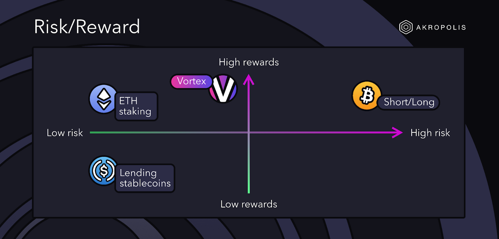

# 💫 Overview

## What is Vortex?

**Vortex** (v1) is an on-chain basis trading strategy that aims to generate long-term, sustainable and rewarding yields while remaining market-neutral.

## Advantages of using Vortex

Advantages of using Vortex (v1) include:

* **Market Neutrality** - Vortex allows users to generate yield without being exposed to directional price risk. Regardless of whether it’s a bull, bear or crab season, Vortex should generate sustainable yields.
* **Rewarding Yields** - Vortex’s underlying strategy has proven to be profitable across all market conditions and has historically outperformed many other market-neutral strategies and higher-risk yield farms.
* **Single Asset** - Vortex only requires users to deposit a single asset - USDC. This makes Vortex an effective alternative to lending or farming with stablecoins.
* **Low Maintenance** - Vortex is a passive strategy for our users, but actively managed by our strategists for maintenance and risk management. The returns generated by Vortex are also periodically compounded, further enhancing yield.
* **Ecosystem Benefits** - Vortex provides liquidity that is crucial for decentralized derivative exchanges that offer perpetual contracts to function.

## Risks of using Vortex

Risks involved with using Vortex (v1) include:

* **Smart Contract Risks** - Vortex is a smart contract that will connect to multiple external smart contracts, each with their own risks.
* **Negative Returns** - The use of Vortex may result in negative returns. This could be because of a range of unlikely events, including:
  * The funding rate on perpetual exchanges being consistently against Vortex
  * Vortex’s position(s) being liquidated
  * Excessive slippage caused by a need to exit all Vortex positions quickly
* **Centralization** - The initial launch of Vortex will have elements of centralization, including control by a predetermined strategist who has the ability to open and close strategy positions.
* **Temporary Suspensions** - We may suspend deposits and/or withdrawals at any time for Vortex. We will only suspend when necessary and will notify via our social channels at the start and end of each suspension, providing reasons and time estimates where possible. Unless we say otherwise, funds will be safe.
* **Limits** - Deposit limits will be enforced for Vortex. These will scale quickly over time, but when the displayed limit is reached, further deposits will not be possible until the limit is increased.


_Vortex has procedures in place to help mitigate these risks; see_ [_Risk Management_](../../developer-documentation/vortex/risk-management/)__

